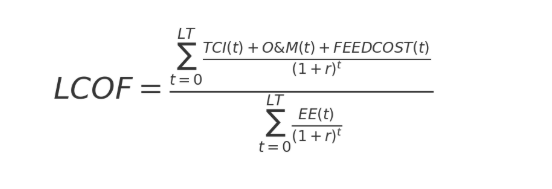

# LCOF.py – Levelized Cost of Fuel Post-Processing Script

## Overview

`LCOF.py` is a post-processing script designed to analyze results from the Optiflow network model, when run hard-linked with the Balmorel energy system model. It calculates the **Levelized Cost of Fuel (LCOF)** by different fuel groups and by transport sectors, reading the model results in GDX format for a given scenario folder. The script supports also the OptiFossil feature from Optiflow, that includes fossil fuels in the simulation, with their market prices.

**Author:** Rossella Frugis

---

## What the Script Does

- **Imports Optiflow and Balmorel model results** from `.gdx` files.
- **Calculates LCOF** for each fuel group and process pathway, considering investment, O&M, feedstock, and fuel production data.
- **Handles fossil fuel flows** (Diesel, MDO, Kerosene) with fixed input costs if present.
- **Generates and saves plots** of LCOF by fuel group and by transport sector.
- **Exports CSVs** for each renewable fuel group, produced by a renewable fuel pathwat, two csvs are produced, one where the table used for the LCOF calculation is printed and the other one, showing the feedstock consumption for each fuel production pathway.

---

## Script Structure

### 1. **Imports and Settings**
   - Loads required Python libraries (pandas, numpy, matplotlib, seaborn, plotly, gams.transfer, etc.).
   - Sets display options for pandas DataFrames.

### 2. **User Configuration Section**
   - **Scenario definition:** List of tuples with scenario names and paths to Optiflow result folders.
   - **Output settings:** Toggle for saving plots as PDF and output file paths.

### 3. **Data Import Functions**
   - `Import_allendofmodel()`: Loads end-of-model results from GDX.
   - `Import_OptiflowMR()`: Loads main Optiflow results from GDX.
   - `Import_BalmorelMR()`: Loads Balmorel model results from GDX.

### 4. **Average Cost of Feedstocks Computation Functions**
   - `Avg_yearly_price()`: Calculates average yearly price for electricity, hydrogen, or heat.
   - `Avg_yearly_biomass_price()`: Calculates average yearly biomass price, including transport costs.

### 5. **Main Calculation**
   - `LCOF_calculation()`: 
    - Calculates LCOF for each fuel group.

        The LCOF was computed for each group as:

        

        Where:
        - `t` represents a year,
        - `LT` is the lifetime of the producing technology; if multiple technologies are used in a pathway, the longest lifetime is selected,
        - `TCI(t)` is the total cost of investment (year 0 and at replacement points),
        - `O&M(t)` is the sum of fixed and variable operation and maintenance costs,
        - `FEEDCOST(t)` is the cost of feedstock used for renewable fuel production,
        - `EE(t)` is the energy output,
        - `r` is the discount rate.

        For simplicity, fuels produced by the same pathway are assigned the same LCOF in this analysis.

        - Exports results as CSV.
   - **Fossil fuel overwrite:** If fossil flows are present, their market price is set, in order to then compute the LCOF by transport sector. Despite it is here called LCOF by sector, it is clear that if fossil fuels are included in the simulation with their market prices, the cost obtained by transport sector is not exactly an LCOF.

### 6. **Plotting Functions**
   - `plot_lcof_bar()`: Plots LCOF by fuel group.
   - `plot_LCOF_bysector()`: Plots LCOF by transport sector, which is computed as the weighted average of the LCOFs of the fuels supplying each transport sector's demand.

### 7. **Execution Block**
   - Runs the LCOF calculation for the selected scenario.
   - Generates and saves plots.

---

## How to Use

1. **Install dependencies**  
   Make sure you have the required Python packages:
   ```
   pip install pandas numpy matplotlib seaborn plotly kaleido
   ```
   > Note: `gams.transfer` requires a working GAMS installation.

2. **Configure the script**  
   - Edit the `scenario` list to point to your Optiflow result folders.
   - Set `save_pdf = True` if you want to save plots as PDF.

3. **Run the script**  
   ```
   python LCOF.py
   ```

4. **Outputs**  
   - CSV files with LCOF tables for each fuel group.
   - Plots of LCOF by fuel group and by sector (PDF if enabled).

---

## Notes

- The script expects Optiflow and Balmorel results in GDX format.
- You may need to adapt mappings and scenario paths for your specific model setup.
- For questions, refer to the comments in the code or contact the author.

---